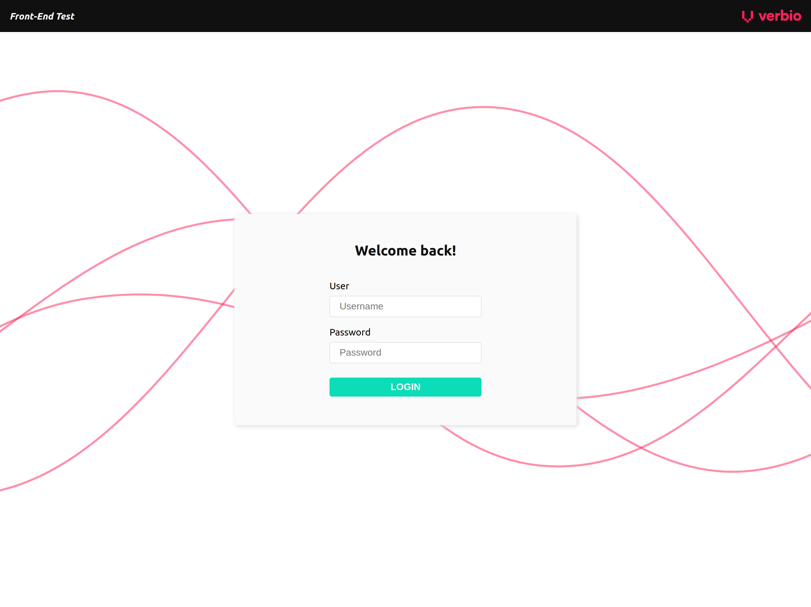

# Verbio Front-End Test

This project is a technical assessment for applying to the [Front-End Engineer](https://www.verbio.com/jobs/frontend-engineer) position opened by Verbio. 
This repository contains a frontend with a login page, and a chat page to interact with a bot.

## Getting Started

### Prerequisites

You should install the [Node Version Manager (NVM)](https://github.com/nvm-sh/nvm) and [Yarn](https://yarnpkg.com/) in your machine in order to serve this application.
I faced issues with some Node versions running some of the `react-scripts`, at least the one related to the tests.
Due to this situation, I fixed the preferred engines on the `package.json`:

```
"engines": {
    "node": "14.17.0",
    "yarn": "1.22.17"
},
```

I strongly recommend using this configuration, otherwise you may face errors.

### Installing

On the project root:

1. Once you have Node and Yarn running on your machine, proceed to run `yarn` for installing the `node_modules`.
2. Then, find the file `.env.sample`. You will see it includes the following content:

    ```
    REACT_APP_API_URL=http://localhost:5556
    ```

3. Rename the file from `.env.sample` to `.env` and update the environment variable as your needs.
4. Execute `yarn start` on the project root. This command runs the app in development mode.
5. If it is not launched automatically, please open [http://localhost:3000](http://localhost:3000) to view the application in the browser.

## Available routes

### / or /login



### /chat


### /[fallback] (404 page)


## Available Scripts

In the project directory, you can run:

### `yarn start`

Runs the app in the development mode. Open [http://localhost:3000](http://localhost:3000) to view it in the browser. The page will reload if you make edits. You will also see any lint errors in the console.

### `yarn test`

Launches the test runner in the interactive watch mode. See the section about [running tests](https://facebook.github.io/create-react-app/docs/running-tests) for more information.

### `yarn build`

Builds the app for production to the `build` folder. It correctly bundles React in production mode and optimizes the build for the best performance. The build is minified and the filenames include the hashes. The app is ready to be deployed! See the section about [deployment](https://facebook.github.io/create-react-app/docs/deployment) for more information.

### `yarn eject`

**Note: this is a one-way operation. Once you `eject`, you can’t go back!**

If you aren’t satisfied with the build tool and configuration choices, you can `eject` at any time. This command will remove the single build dependency from your project. 

Instead, it will copy all the configuration files and the transitive dependencies (webpack, Babel, ESLint, etc) right into your project so you have full control over them. All of the commands except `eject` will still work, but they will point to the copied scripts so you can tweak them. At this point you’re on your own.

You don’t have to ever use `eject`. The curated feature set is suitable for small and middle deployments, and you shouldn’t feel obligated to use this feature. However we understand that this tool wouldn’t be useful if you couldn’t customize it when you are ready for it.

### `yarn format`

Formats all files supported by Prettier in the current directory and its subdirectories. 

### `yarn storybook`

Runs Storybook in the development mode. Open [http://localhost:6006](http://localhost:6006) to view it in the browser.

### `yarn build-storybook`

Builds Storybook for production to the `storybook-static` folder.

### `cypress:open`

Open the Cypress Component Test Runner.

### `cypress:run`

Executes all the specs over the console (does not open the Test Runner client).

## Project structure
    .
    ├── .storybook              # Storybook configuration
    ├── cypress                 # Testing files
    ├── src                     # Source files
    ├── public                  # Root folder that gets served up as the final React app
    └── ...

For more information about other files included after CRA bootstrapping, check this [link](https://medium.com/@abesingh1/create-react-app-files-folders-structure-explained-df24770f8562).

### /src main files and directories

    src
    ├── API                     # Endpoints encapsulation
    ├── assets                  # Statics (images)
    ├── components              # Atoms, molecules, organisms, pages and stories
    ├── contexts                # React Contexts (i.e. `AuthContext.tsx`)
    ├── hooks                   # React Hooks (i.e. `useSession.ts`)
    ├── utils                   # Tools and utilities (i.e. `Date.ts`)
    ├── constants.ts            # Place for declaring application constants, like routes and other default values
    └── ...

Notice I am applying the [Atomic Design](https://bradfrost.com/blog/post/atomic-web-design/) methodology for grouping components, 
for that reason you see the separation in atoms, molecules, organisms and pages.

## Built With

- [Create React App (CRA)](https://github.com/facebook/create-react-app) - An officially supported way to create single-page React applications
  - [TypeScript](https://www.typescriptlang.org) - Strongly typed programming language that builds on JavaScript
  - [React Testing Library](https://testing-library.com/docs/react-testing-library/intro) - Very light-weight solution for testing React components
- [React Router](https://reactrouter.com/) - Client-side routing manager
- [SASS](https://sass-lang.com) - CSS with superpowers
- [Storybook](https://storybook.js.org/) - Tool for building UI components and pages in isolation
- [Prettier](https://prettier.io/) - Code formatter
- [Cypress](https://www.cypress.io/) - End-to-End testing framework for web test automation

## Authors

* **María Morales** - *Front-End Implementation* - [maremarismaria](https://github.com/maremarismaria)

## License

All the assets related to [Verbio](https://www.verbio.com/), such as the favicon, the logo, or the color palette used on this project belongs to Verbio Technologies S.L.
They were used on this technical assessment just for contextualization.

The SVG Background was made by [BGJar](https://bgjar.com), and shared under the [CC BY 4.0](https://creativecommons.org/licenses/by/4.0/) license.

## Acknowledgments

* To the React, TypeScript, Testing Library, React Router, SASS, Storybook, Prettier, Cypress and all the Open Source developers for allowing us to continue building amazing things.
* To the Verbio Team, for this opportunity, and for your time.
